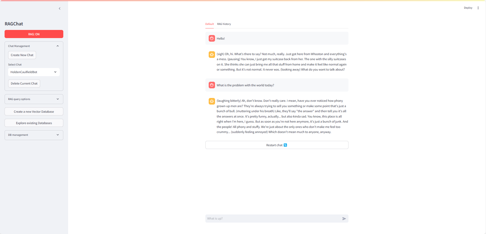
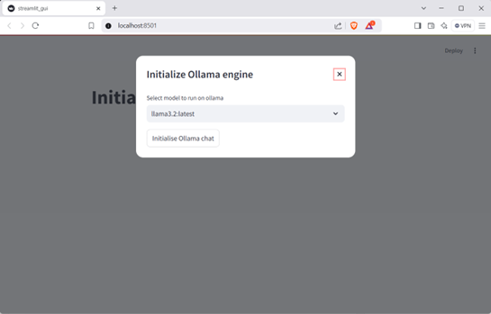
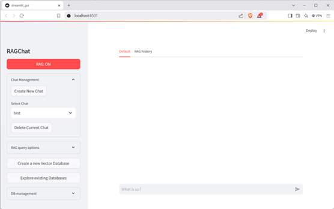
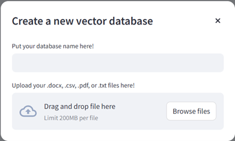
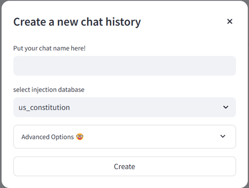

# Local RAG workshop app
This is an app built for the local Retrieval Augmented Generation (RAG) workshop being run by the [Queensland University of Technology GenAI lab](https://research.qut.edu.au/genailab/).

This is a barebones app that allows non-technical users to build their own RAG-enabled LLM chats. The RAG backend is ChromaDB (using their default all-MiniLM-L6-v2 embedding model), whereas the LLM chat backend is enabled by a separate, external install of [Ollama](https://ollama.com/).

# Features
- drag-and-drop Vector Database creation for .doc/.docx, .pdf, .txt, and .csv files
- sliders for Vector DB injection return (number of items injected, maximum distance from query)
- support for multiple persistent chat histories and databases over sessions
- can tab between RAG and non-RAG chat histories to see exactly what has been injected into prompt
- can toggle on/off RAG enablement
- explore VectorDBs with queries and 3D UMAP visualisation of embedding space

# Build instructions
This codebase was built on python 3.11, but also (accidentally) confirmed working on python 3.12. Should also work on Python 3.10.

### Building the app
Currently, if you know python (which if you're on github, I'm imagining you do), you just need to install everything in requirements.txt and you can either navigate to `/app` and then run `python3 run.py` or  `streamlit run streamlit_gui.py` to boot the app.

To 'compile' into an executable file for the OS+instruction set you're currently running on, navigate to `/app` and run `python3 build_executable.py`, which will execute the relevant PyInstaller command to build the app into a portable executable file. The output will be in `/app/dist/run`, which is a directory which will contain the executable `run` file, as well as an `_internal` directory for relevant packages and other stuff. Moving the `/run' folder around will allow you to run the RAG GUI on whatever computer has an Ollama install!

### Pre-reqs for running the app
- [Ollama](https://ollama.com/) installed

## Compatibility
Currently, 'compilation' of functioning executables are confirmed on:
- Windows x86/64
- Linux x86/64
- MacOS ARM
- MacOS x86/64

# QUICKSTART
First start up Ollama as a background service, and make sure it's on the same machine (i.e. don't run ollama on a separate docker image to this program)

Once the app is launched (either through running a compiled executable, or through local `python3 run.py` command), you'll see this screen to begin with:

Pick whichever Ollama model you'd like to use for the session, adn then hit 'Initialise Ollama chat'.

Once loaded, you'll get a screen which looks like this:

To create a new chat with a new vector database, we first start by clicking “Create a new Vector Database” on the left-hand sidebar.

You are able to upload **ONE** file here that will then be embedded. The file must be either a .pdf, .txt, .doc/.docx or .csv. Your DB name must also have no spaces or special characters (sorry!).

(i.e. – if you want to upload multiple files into the database, conglomerate them into a single file. You can copy and paste everything into a word document for example, or add .csv files together in excel. The world is your oyster here).

If you are unfamiliar with the settings that pop up after the file is uploaded, feel free to ignore them. If anything, if you’re uploading a .csv (essentially an excel spreadsheet/table), just pick the column that you want to embed specifically (e.g. if you have a twitter dataset, you probably want to embed the tweet text, rather than the username or the date).

Once your database is finished embedding, you can go ahead and click "Create New Chat" in the sidebar, under "Chat Management":

Give your chat a title (with no spaces or special characters), select the relevant database to use for injection and bob’s your uncle! Go nuts!

## Notes:
- to keep release sizes small, and to decouple from (some) default models, no Ollama models or ChromaDB models are pre-downloaded. This means that **you must be online while first booting the app and creating your first vector DB. After that, you will be able to use the app fully offline, as default models will be downloaded**.
- No default chats or dbs are pre-loaded - to create a chat, you must first embed a document into a vector database.

## Known bugs:
- on MacOS, when changing databases on the Explore DB page, a new streamlit process will spawn. You can ignore this new streamlit process (and close the automatically opened new app window), as it will not affect your existing streamlit process.
- also on MacOS, there are sometimes issues with app sandboxing, similar to what is described [here](https://stackoverflow.com/questions/44627957/mac-os-file-system-sandbox-blocked-open). Troubleshooting this bug is ongoing.

For any other bugs, please submit an issue [here](https://github.com/QUT-GenAI-Lab/local_rag_workshop/issues).
### License
We're releasing this software with an open source license (see LICENSE), but if you want to use this for any commercial purpose, contact us to discuss dual-licensing arrangements.

